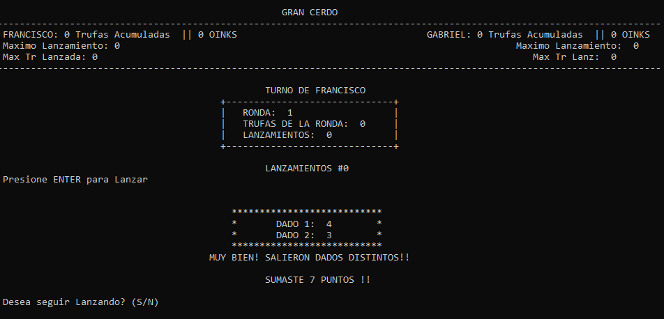

## Juego Gran Cerdo - UTN

  

## Objetivos del Proyecto

Aplicar conocimientos de los temas visto en Programacion en C++: 
-variables y sus tipos
-vectores y matrices
-funciones
-diagramacion de algoritmos

## Imagenes de Proyecto Final

**MENU**

  

**INGRESO DE NOMBRES**

  

**SELECCION DE PRIMER LANZADOR**

  

**RONDA DE JUEGO**

  

**CALCULO DE GANADOR**

  

Gran Cerdo es un juego de dados de dos jugadores en el que intervienen el azar y la codicia.
El objetivo general del juego es sumar la mayor cantidad de puntos de victoria en un total de 5 rondas. La suma de puntaje depende de diferentes situaciones que se pueden dar en el juego y que más adelante se explicarán.
Se juega con dos o tres dados de seis caras por cada jugador. Antes de comenzar, se debe determinar cuál de los dos jugadores empieza. Para ello se lanzan dos dados y el jugador que haya obtenido el mayor puntaje comienza. Si empatan en el puntaje, comienza el jugador que haya obtenido el dado más alto. Si empatan nuevamente vuelven a lanzar ambos dados otra vez.

El juego está compuesto por cinco rondas por jugador y en cada ronda el jugador dispone de ilimitados lanzamientos. 
En cada lanzamiento el jugador tira los dados y se analiza los valores de las caras:

-	Si las caras son distintas entre sí y ninguna de ellas es un as. Entonces el cerdo acumula trufas según la suma de las caras al total de la ronda. Por ejemplo: 5 y 3 → Acumula 8 trufas. Luego, puede decidir si volver a lanzar los dados o plantarse y ceder el turno al otro cerdo.
NOTA: Si está lanzando con tres dados y hay dos caras iguales y una distinta (siempre que no sean ases). Ejemplo: 5, 5 y 3. Es correcto que realice cualquiera de estas dos alternativas:
-	No sume ninguna trufa en ese lanzamiento y le pregunte al jugador si desea seguir lanzando.
-	Sume todos los dados en concepto de trufas y le pregunte al jugador si desea seguir lanzando.

-	Si las caras son iguales entre sí y no son ases. Entonces el cerdo hizo un Oink y  acumula trufas por el doble de la suma de las caras al total de la ronda. Por ejemplo: 4 y 4 → Acumula 16 trufas. También, está obligado a lanzar los dados una vez más.

-	Si las caras son distintas entre sí y hay un as entre ellas. Pierde todas las trufas que venía acumulando en la ronda actual y automáticamente le cede el turno al otro cerdo.

-	Si dos de las caras son iguales entre sí y son ases. El cerdo se hunde en el barro y pierde todas las trufas que venía acumulando en las rondas anteriores y la actual; y automáticamente le cede el turno al otro cerdo.
NOTA: Pierde todas las trufas que venía acumulando hasta el momento incluyendo las de la ronda que venía jugando.

-	Si se está lanzando con tres dados y tres de las caras son iguales entre sí y son ases. Aplica la misma quita de puntos que en el caso anterior pero dichos puntos se acumulan al otro cerdo en dicha ronda.

El juego utiliza dos dados hasta que ambos cerdos superen (cada uno) las 50 trufas o alguno de ellos se hunda en el barro. A partir de allí, el juego se desarrolla con tres dados por lanzamiento (esto puede ocurrir incluso en el transcurso de una ronda).

 
Cuando finalizan las rondas, se determina el puntaje final a partir de los siguientes hitos en el juego.

|**Hito**|**Puntos de victoria**|
| :- | :- |
|Más trufas en total|5 PDV|
|Cada 50 trufas|1 PDV|
|Oink|2 PDV \* Cantidad de Oinks|
|Cerdo codicioso (ronda con mayor cantidad de lanzamientos)|3 PDV|

En caso de que algún hito resulte en empate entre ambos cerdos. El puntaje se otorga a ambos. Gana el juego el cerdo que haya obtenido más puntos de victoria.

  

## Actividad Propuesta

Se pide desarrollar en C/C++ el juego Gran Cerdo haciendo uso de un proyecto de Aplicación de Consola.

El juego debe contar con un menú principal con las siguientes opciones:

|
GRAN CERDO

---------------------

1 - JUGAR

2 - ESTADÍSTICAS

3 - CERDITOS

---------------------

0 - SALIR
|
| :- |

La opción jugar, debe permitir iniciar un nuevo juego de Gran Cerdo. Antes de comenzar el juego debe solicitar a los jugadores el nombre.

Luego, el juego debe mostrar la información necesaria para que los usuarios puedan jugarlo. Esto, como mínimo, debe ser: el número de ronda actual, el nombre del jugador que está tirando, la tirada de dados del jugador actual, la cantidad de lanzamientos del jugador actual, la cantidad de trufas del jugador en la ronda actual, la cantidad de trufas totales del jugador y del contrario.

Luego de una tirada de dados y si corresponde según las reglas del juego, se le debe solicitar al jugador ingresar si desea continuar lanzando. A esto debe responder con S para continuar o N para no continuar. Cualquier otro ingreso debe resultar en repreguntar al jugador si desea continuar lanzando.

Al finalizar todas las rondas, se debe mostrar una pantalla como la siguiente e informar quien es el cerdo ganador:

|
GRAN CERDO

------------------------------------------------------------------------

HITO                   PEPPA                     GEORGE

------------------------------------------------------------------------

Más trufas en total    5 PDV (320 trufas)        0 PDV (280 trufas)

Cada 50 trufas         6 PDV (300 trufas)        5 PDV (250 trufas)

Oinks                  6 PDV (3 Oinks)           8 PDV (4 Oinks)

Cerdo codicioso        0 PDV (8 lanzamientos)    2 PDV (10 lanzamientos)

------------------------------------------------------------------------

TOTAL                  18 PDV                    16 PDV

GANADOR: PEPPA con 18 puntos de victoria.      

Ingrese Oink para continuar: 
|
| :- |
La opción estadísticas, debe mostrar el nombre del jugador que haya obtenido la mayor cantidad de puntos de victoria y dicha cantidad.

La opción cerditos (o créditos), debe mostrar los apellidos, nombres y legajos de los integrantes del equipo. Así como también el nombre del equipo.

La opción salir, debe salir del juego previa confirmación del usuario.

**Créditos**

- Imágenes de cerdos obtenidas de Freepik creado por [Vectormass Studio](https://www.freepik.es/vectormassstudio).
- Logo de cerdo obtenido de Flaticon por creado por [Rlkas Dzihab](https://www.flaticon.com/authors/rikas-dzihab)
- Juego inventado por Angel Simón. Inspirado en el juego Pig.

